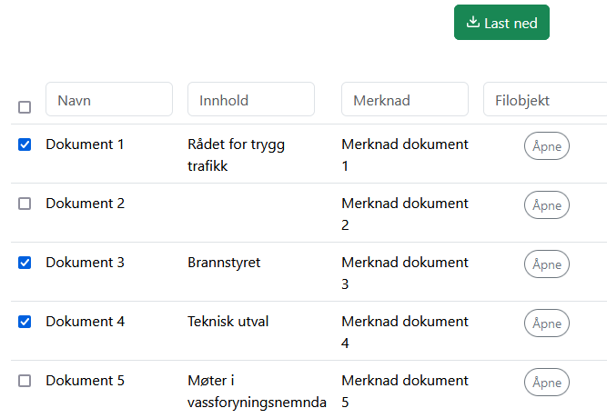
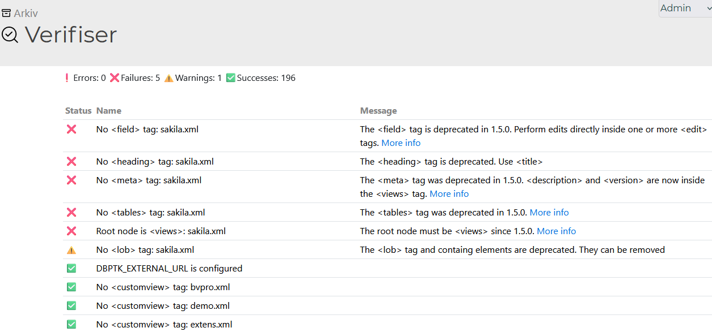
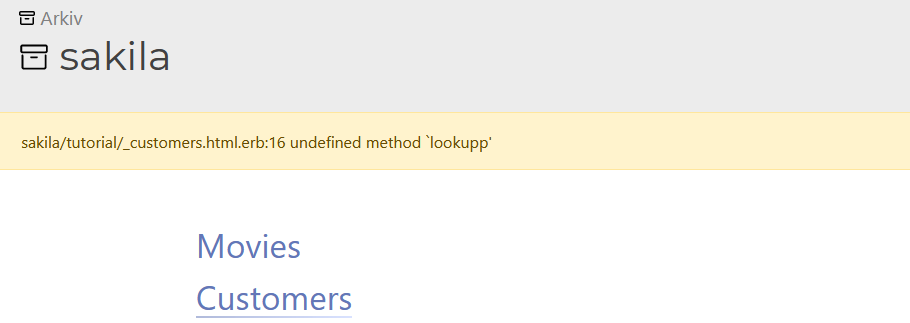

# Name change
KDRS Innsyn is now called KDRS Search & View.

# Download multiple files
It is now possible to download multiple files at once as a zip-archive, by checking the checkboxes for the files you want.

See [`<export>`]({{'xml/export' | relative_url }}) and [`<filename>`]({{'xml/filename' | relative_url }}) to use this feature.

# Easier installation and configuration

Installation and is made easier, by including an install script.
This ensures correct Docker version and loads the Docker image.

Configuration of the system is now done by modifying a simple .env file, rather than the full docker-compose.yaml.

# Many XML simplifications

To make writing and reading XML templates easier, we have removed several unnecessary tags.

  

  <h2>Before</h2>

<root>
    <meta>
        <version>0.1.0</version>
        <description>sakila movie database</description>
    </meta>
    <views>
        <view>
            <name>movies</name>
            <tables>
                <table>
                    <name>film</name>
                    <heading>movies</heading>
                    <fields>title,description</fields>
                    <primarykey>film_id</primarykey>
                </table>
            </tables>
        </view>
    </views>
</root>

  

  

    <h2>After</h2>

<views>
    <version>0.1.0</version>
    <description>sakila movie database</description>
    <view>
        <name>movies</name>
        <table>
            <name>film</name>
            <title>movies</title>
            <fields>title,description</fields>
            <primarykey>film_id</primarykey>
        </table>
    </view>
</views>

  

# Verification

To detect common mistakes and ensure validity of templates, we have introduced a verification system, available to archivists and administrators. This system checks every template (XML and Ruby) as well as system settings. This tool can be helpful when updating templates to 1.5, as all deprecated tags will be detected. It is accessed through the navigation menu.

# Better error messages
Instead of the "Something went wrong" page, selected code errors will now be displayed in app for archivists and administrators. In this way we try to keep security while providing better developer feedback.

