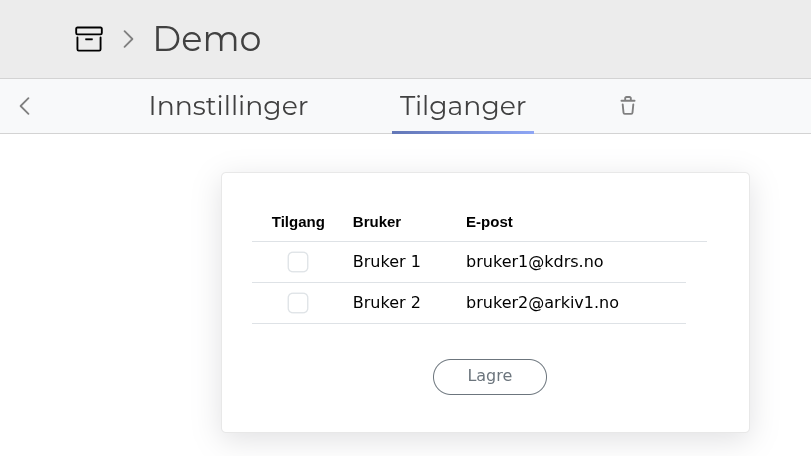
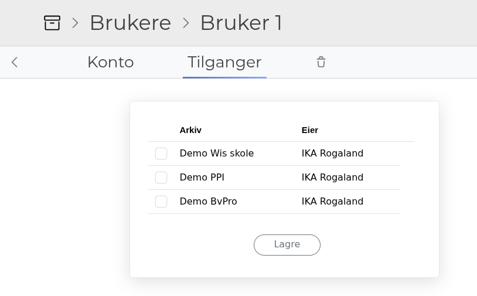
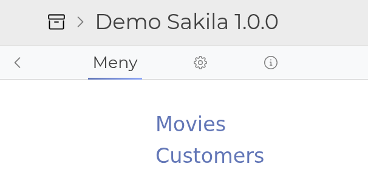
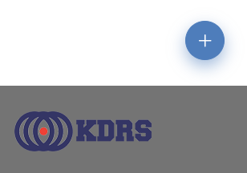
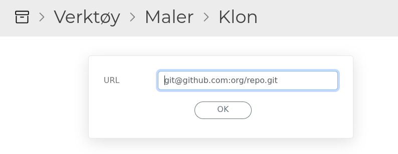
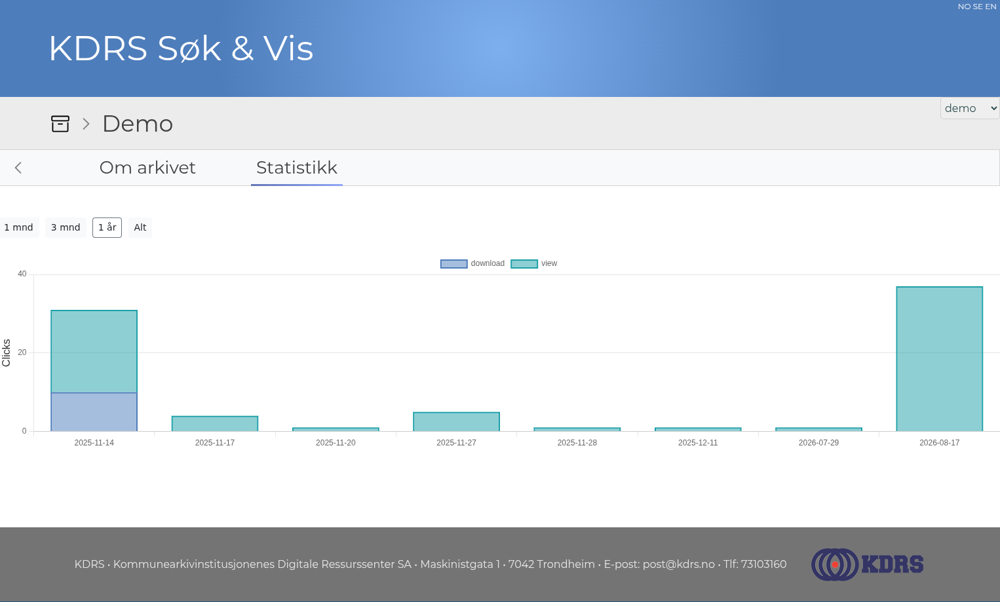

Highlights for KDRS Search & View 1.7.0 (June 2026) and 1.7.1 (August 2026).
{: .fs-6 .fw-300 }

# Table of Contents
{: .no_toc .text-delta }

1. TOC
{:toc}

# New features

## Updated admin interface

You can now assign users directly from an archive:

And assign archives directly from a user:

## Tab based navigation

## Plus button

New items are created with the plus button on the bottom right side of the page.  

## Archiver role expanded

- See all users and all companies
- Manage any archive
- Delete a company

## Header and footer partials

A Ruby view can now render the header and footer fields defined in XML with `render 'header'` and `render 'footer'`.

## Clone templates from URL

Clone templates directly from a URL, in addition to the git server at [maler.kdrs.no](https://maler.kdrs.no).

## Streamed downloads

Downloads of LOBs and zip files are now streamed, reducing memory usage and improving performance for large files. 

## Enhanced statistics

- Grouped by activity type (view/download)
- Period selector: 1 month, 3 months, 1 year, all time

## Validation improvements

- Validations show the path to the file with the error
- Detects foreign keys without a parent record

## XML

- Duplicate tag detection
- The `row` tag with value `max` fetches the maximum number of rows (currently 10.000)

## Security scanning

Added bundler-audit as a security scanner for dependencies.

# Improved or fixed

## 1.7.1

- db: upgrade could stop on `db:migrate`
- user grants: archives sorted by name
- ui: forms and tables adapt when the window is narrow
- ui: less wrapping in grants pages
- ui: cosmetic fixes
- lib: Puma webserver 6.x to 7.x
- lib: local Tomcat CAS server 9.0.117 to 9.0.120

## 1.7.0

- user grants: full name and email are shown instead of company name, and the list is sorted
- statistics: view was not scoped to the current archive
- security: user catalog update not allowed when `LOCAL_LOGIN=false`
- security: fix for the archiver role
- security: renaming a company in the cloud now requires admin
- lobs: MIME type detection was not running for Solr LOBs
- ui: redirect loop when the redirected page also had an error
- ui: print and download buttons are now translated
- templates: crash when the template manager was loaded concurrently
- db: MySQL tables are converted from utf8mb3 to utf8mb4
- lib: Rails 6.1.7.10 to 8.0.2
- lib: Ruby 3.2.2 to 3.3.7
- lib: Solr 8 to 9
- lib: DBPTK 2 to 3

# Deprecated

- The `customview` tag is deprecated. Use [`rubyview`]({{ 'xml/rubyview' | relative_url }}) instead.
- The logo feature has been removed. We are considering built in logos.
- Edit mode deprecated

