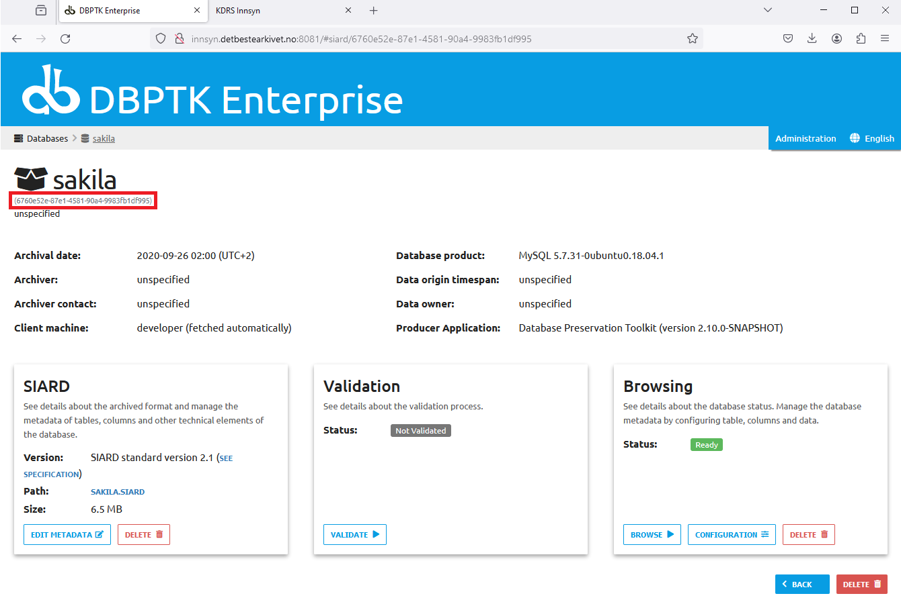
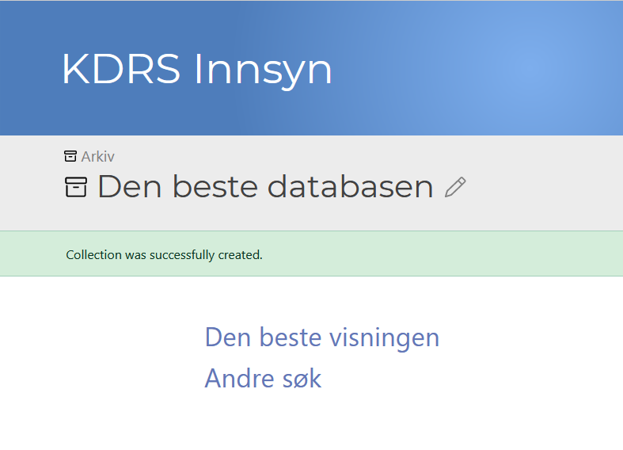

Now we are ready to create our first XML template and display data from the Sakila sample SIARD-file.

XML templates are stored in the `vendor` folder where KDRS Innsyn is stored. The full path would generally be `/var/kdrs/innsyn/vendor`.

1. Within the `vendor` folder, create a new XML file named `innsyn_tutorial.xml`.\
*This file can be placed in either the root of or in any subdirectory of the `vendor` folder. Only the name of the file matters.*

2. Now we will fill the file with the bare minium to make it display something in KDRS innsyn:

<views>
    <view>
        <name>Den beste visningen</name>
    </view>
</views>

*You can choose whatever you want for the name*\
\
This creates a new "View" for our database, which is a collection of tables. We will add the tables later.

{: style="counter-reset: step-counter 2;" }
1. Now we need the UUID of our database. It is found in the top left of the database overview in DBPTK. Copy this ID for the next step (without the enclosing parentheses).\
 

4. Now go to the KDRS Innsyn frontpage. Enter edit mode by choosing "Rediger" in the navigation menu, and click "Nytt innsyn" to add our new template and link it to the database.\
 

5. Here we need to enter some information for the new database.\
 The field "Solr ID" should contain the UUID we found in step 3.\
  For the 2 first fields, you are free to enter a title and description of your choosing, but it is **required** that one of these two fields contain the filename of our XML template. Because our XML file is `innsyn_tutorial.xml`, we have added that name to the description. After completion, click "OK".\
 

6. Now you should see an overview of the new database, showing a link to the view we defined in the XML template. Clicking the link at this point will cause an error, as we have not yet created any tables for it.\
 

We are now ready to start editing our XML template further to actually extract and present some data from our SIARD-file.