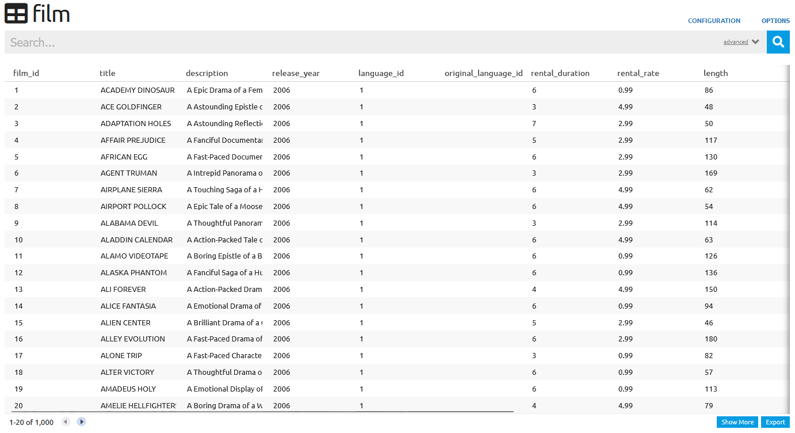

Now we will actually show some information stored in the database.\
The following image shows a schema of all the tables in our database:\
 

*The database schema is from DBPTK, and is found by clicking "BROWSE" in the database overview*\
 
The table *film* looks interesting, so we will click that to view it:\
 

  
Our first task will be to show the title and description of every film in a table.
 
1. To do this, we have to start by defining a new table for our view. We do this by adding a [`<table>`](../../default-view/table) tag in our XML template:


<views>
    <view>
        <name>Den beste visningen</name>
        <table>                    
        </table>
    </view>
</views>


{: style="counter-reset: step-counter 1;" }
2. Within the `<table>` tag, there are 4 required tags we need to specify. These are `<name>`, `<heading>`, `<primarykey>` and `<fields>`.\
The purpose of these tags is as follows:
 
  
| XML tag | Value |
| ----- | ---------- |
| [`<name>`](../../default-view/name) | The name of the table in the database we want data from. As we are getting data from the table *film*, the value will be `film`|
| [`<heading>`](../../default-view/heading) | The name that will be displayed above our table. This can be set to anything you want. |
| [`<primarykey>`](../../default-view/primarykey) | A primary key is a column that has a unique value for every row in a table. For the *film* table the unique column is *film_id*, so we have to set the primary key to `film_id` |
| [`<fields>`](../../default-view/fields) | This is a list of columns we want to show data from. The list is comma-separated, so because we want to show data from the columns *title* and *description*, we have to set fields to `title, description` | 

{: style="counter-reset: step-counter 2;" }
3. Update the XML template file with the required tags: 

...
<table>
    <name>film</name>
    <heading>Den beste tabellen</heading>
    <primarykey>film_id</primarykey>                    
    <fields>title, description</fields>
</table>
...

*Some parts of the XML file that were not changed in this step have been omitted.*

{: style="counter-reset: step-counter 3;" }
4. If we open our view now, it should show a table with columns for titles and descriptions.\
 

Now we have a fully working table, and are ready to learn some more advanced techniques!