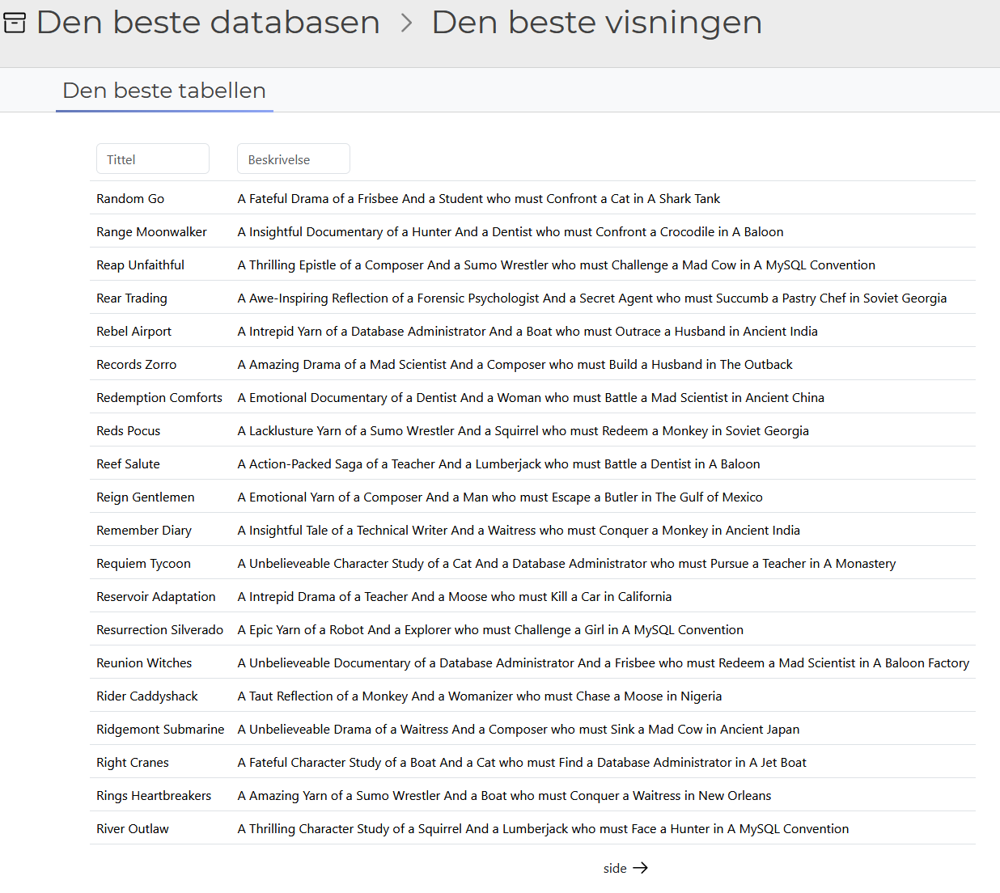

Our table looks pretty good already, but let's say we want to make it even better by changing the column headers, and having the titles not be capitalized.

1. To change the column headers, we need to specify the new names within the `<fields>` tag. We do that by adding `as (name)` after the column name, where, `(name)` can be whichever header name we want. Modify the XML-template to include some names of your choosing.


...
<table>
    <name>film</name>
    <title>Den beste tabellen</title>
    <primarykey>film_id</primarykey>                    
    <fields>title as tittel, description as beskrivelse</fields>
</table>
...


{: style="counter-reset: step-counter 1;" }
1. Now we will make the title fields look better, by improving their capitalization. We can do this by using the [`<edit>`]({{ 'xml/edit' | relative_url }}) tag. It allows us to run Ruby methods on the fields before displaying them. A very useful method for our usecase is [`titleize`](https://apidock.com/rails/String/titleize). This method makes text look like a title, by capitalizing the first letter of every word. To use the `<edit>` tag we write on the format `fieldname.method_to_perform` within it.

...
<table>
    <name>film</name>
    <title>Den beste tabellen</title>
    <primarykey>film_id</primarykey>                    
    <fields>title as tittel, description as beskrivelse</fields>
    <edit>tittel.titleize</edit>
</table>
...

Note that we had to use the name we gave in step 1 to perform the edit. This is because the `as` keyword renames the variable itself.

{: style="counter-reset: step-counter 2;" }
3. That's it! Now our table looks even better!\
 
