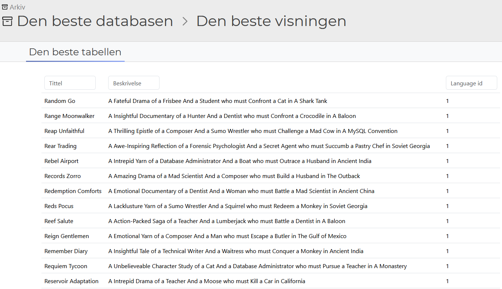
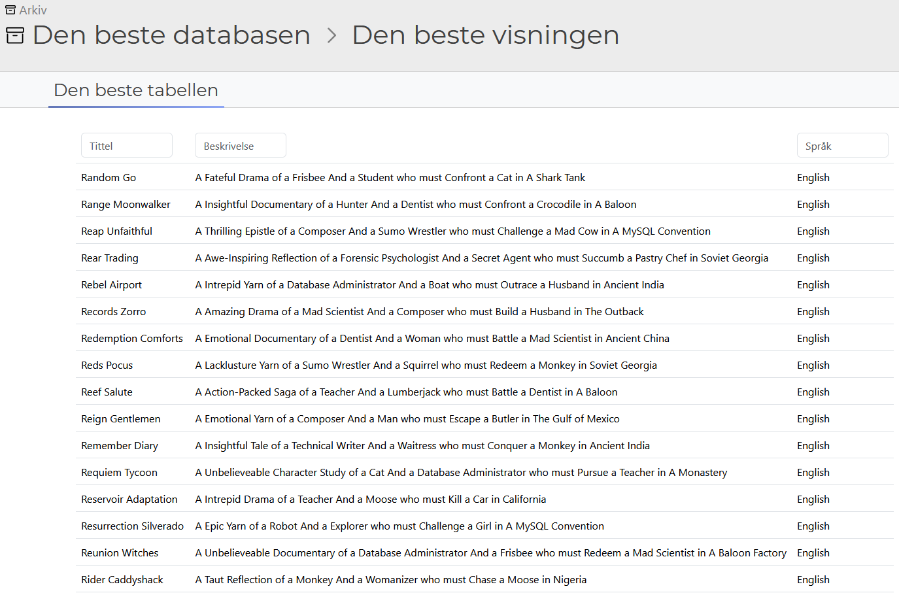

Now it's time to get a bit more advanced, by including data from another table in the database.

1. Within the table `film` there is a column `language_id`, which we will add to our `<fields>` tag.


...
<table>
    <name>film</name>
    <title>Den beste tabellen</title>
    <primarykey>film_id</primarykey>                    
    <fields>title as tittel, description as beskrivelse, language_id</fields>
    <edit>
        <field>tittel.titleize</field>
    </edit>
</table>
...

Now our table looks like this:\
 

{: style="counter-reset: step-counter 1;" }
2. As you can see, the `language_id` column has been added, but it is unfortunatly not very user-friendly in it's current state, as the language is only represented by a number. This is because there is another table in our database: `language`, which correlates the IDs with a language.\
 

3. To make our table use the name of the language instead of the ID, we need to use the [`<lookup>`](../../default-view/lookup) tag. This tag allows us to use a field as a key in another table, to replace the field itself with values from that second table. The `<lookup>` tag requires 4 child tags within it, which are as follows:
    
| XML tag | Usage |
| ----- | ---------- |
| `<table>` | The name of the table we want to lookup data within. In our case this will be `language`. |
| `<primarykey>` | The name of the column from our original table (`film`) that we will match against a key in the new table (`language`). In our case it is `language_id` |
| `<foreignkey>` | The name of the column in the table we are performing the lookup within that will be matched against the `<primarykey>`. This is also `language_id`, as the columns have the same names in both the `film` and `language` tables. |
| `<fields>` | The names of the columns we want to retrieve data from. We only want the name of the language, which is stored in the `name` column |
    
{: style="counter-reset: step-counter 3;" }
4. That means we need to make the following addition to our XML template:

<table>
    <name>film</name>
    <title>Den beste tabellen</title>
    <primarykey>film_id</primarykey>                    
    <fields>title as tittel, description as beskrivelse, language_id</fields>
    <edit>
        <field>tittel.titleize</field>
    </edit>
    <lookup> 
        <table>language</table>
        <primarykey>language_id</primarykey>
        <foreignkey>language_id</foreignkey>
        <fields>name as språk</fields> <!-- We can rename the field using the "as" keyword we learned in part 5 -->
    </lookup>
</table>


{: style="counter-reset: step-counter 4;" }
5. Now our table includes the language:\
 

