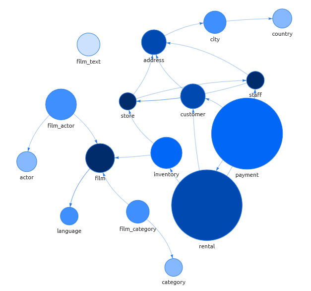
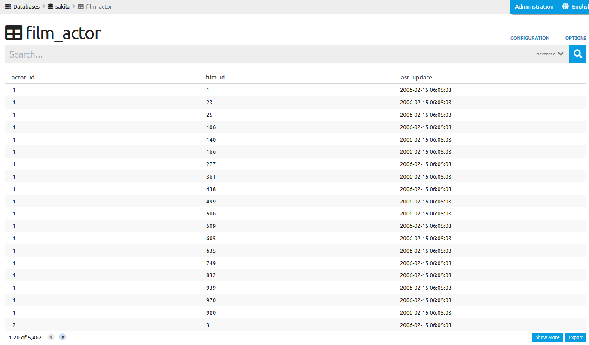
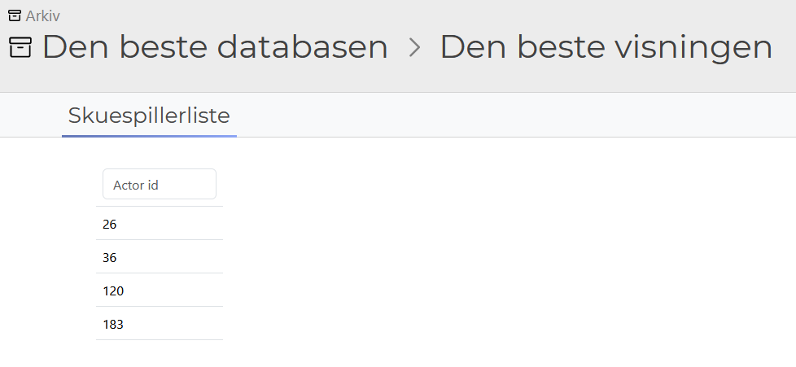

Now we have a list of films, but lets expand it a bit. It could be useful to show which actors played in a film. By using a child table we can let the user click on a film in our first table, which will then open a list of actors that played in that movie.

1. Let's check how the tables of films and actors are related. This can be done in the DBPTK schema. We see that film_actor connects the film and actor table.\
 

2. We can see that the `film_actor` table contains two columns linking actors with films. This is perfect for our child table, because we can click an entry to use one of it's fields as a `<primarykey>`. In our case it will be the `film_id` of the selected film. We will then display the child table `film_actor` which contains only the rows where the specified primary key matches a `<foreignkey>`. The foreign key will also be `film_id`, as `film_actor` has that column.\
 

3. Lets define a new child table in our XML template. This will be done similarily to the first table, but we need 2 extra tags: `<parent>`, which is the name of the parent table, and as mentioned `<foreignkey>`, which will be matched against the primary key of the parent table.

...
<table>
    <name>film</name>
    [...] <!-- Part of our first table omitted to keep the text shorter -->
</table>                
<table> <!-- Our new child table -->
    <name>film_actor</name>
    <title>Skuespillerliste</title>
    <primarykey>film_id</primarykey>
    <fields>actor_id</fields>
    <parent>film</parent>                    
    <foreignkey>film_id</foreignkey>    
</table>
...


Our child table now looks like this:\
 

{: style="counter-reset: step-counter 3;" }
1. The child actor table is still very barebones, so let's improve it by using some previously learned techniques to replace the IDs with names using `<lookup>` and change the column header using `as`.

...
<table>
    <name>film_actor</name>
    <title>Skuespillerliste</title>
    <primarykey>film_id</primarykey>
    <fields>actor_id</fields>
    <parent>film</parent>                    
    <foreignkey>film_id</foreignkey>                 
    <lookup>
        <table>actor</table>
        <primarykey>actor_id</primarykey>
        <foreignkey>actor_id</foreignkey>
        <fields>first_name as fornavn, last_name as etternavn</fields>
    </lookup>
</table>
...


{: style="counter-reset: step-counter 4;" }
5. As a last step it is usually good for child tables like this to have a `<header>` tag that shows which element the child table is a list for, in our case which film. Because we don't have access to film titles within the `film_actor` table, we need to use the `film_id` to perform a lookup on the film table and retrieve the title. 

...
<table>
    <name>film_actor</name>
    <title>Skuespillerliste</title>
    <primarykey>film_id</primarykey>
    <fields>actor_id</fields>
    <parent>film</parent>                    
    <foreignkey>film_id</foreignkey>                 
    <header>title as tittel</header> <!-- The title is retrieved from the second lookup below and renamed. -->
    <lookup>
        <table>actor</table>
        <primarykey>actor_id</primarykey>
        <foreignkey>actor_id</foreignkey>
        <fields>first_name as fornavn, last_name as etternavn</fields>
    </lookup>
    <lookup> <!-- This lookup gets the title from the table film using the film_id -->
        <table>film</table>
        <primarykey>film_id</primarykey>
        <foreignkey>film_id</foreignkey>
        <fields>title</fields>
    </lookup>
</table>


Our child table should now look like this:\
 
