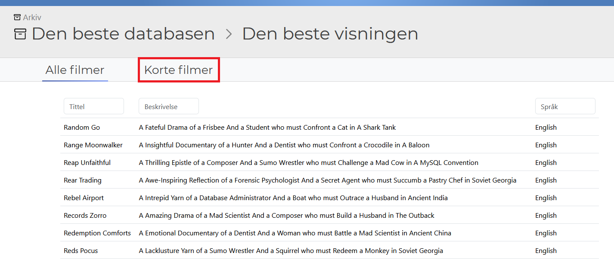
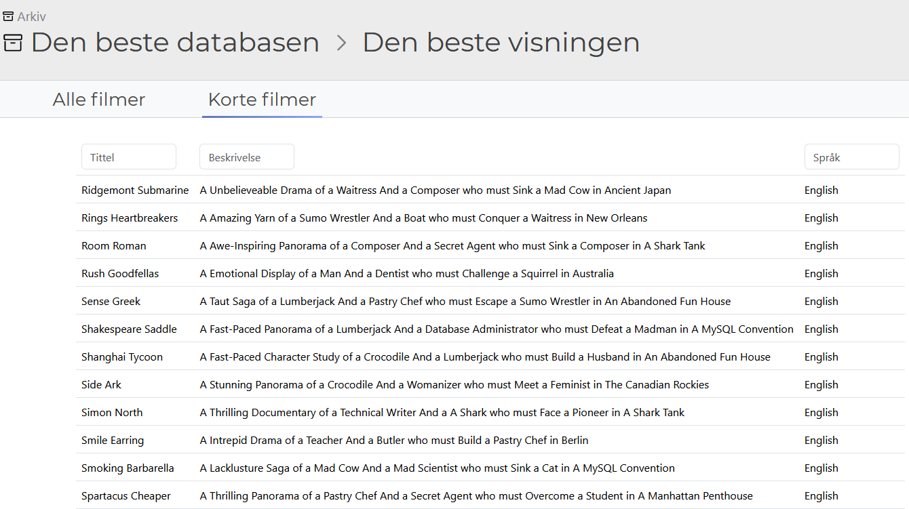

The last feature we will add to our template is a new tab that applies a filter. Lets create a new tab that contains all the short films, meaning one hour or less.

1. We start by adding a `<parent>` tag to our film table. This tag can contain any name that is not the name of another table, but it needs to be the same across all tables that we want grouped by tabs. After this we duplicate the whole table, but change the `<heading>` of the second table to make them differentiable. 


...
<view>
    <name>Den beste visningen</name>
    <table> <!-- Our original table showing all films -->
        <name>film</name>
        <parent>top</parent> <!-- "top" is commonly used to group tables at the top of the hierarchy (no parent tables) -->
        <heading>Alle filmer</heading>
        <primarykey>film_id</primarykey>                    
        <fields>title as tittel, description as beskrivelse, language_id</fields>
        <edit>
            <field>tittel.titleize</field>
        </edit>
        <lookup>
            <table>language</table>
            <primarykey>language_id</primarykey>
            <foreignkey>language_id</foreignkey>
            <fields>name as språk</fields>
        </lookup>
    </table>             
    <table> <!-- The new table that will show short films -->
        <name>film</name>
        <parent>top</parent>
        <heading>Korte filmer</heading>
        <primarykey>film_id</primarykey>                    
        <fields>title as tittel, description as beskrivelse, language_id</fields>
        <edit>
            <field>tittel.titleize</field>
        </edit>
        <lookup>
            <table>language</table>
            <primarykey>language_id</primarykey>
            <foreignkey>language_id</foreignkey>
            <fields>name as språk</fields>
        </lookup>
    </table>
...


Now we can see a new tab appear, which will also list every film.\
 

{: style="counter-reset: step-counter 1;" }
1. Now we need to add a `<filter>` tag to our new table. This tag uses SolR queries, and we can use a [Range Search](https://solr.apache.org/guide/6_6/the-standard-query-parser.html#TheStandardQueryParser-RangeSearches) to filter by the films which have a `length` less than or equal to 60. The syntax for this is `length: [* TO 60]`. Add this within a `<filter>` tag in the new table.


...
<table>
    <name>film</name>
    <parent>top</parent>
    <heading>Korte filmer</heading>
    <filter>length: [* TO 60]</filter> <!-- SolR filter here -->
    <primarykey>film_id</primarykey>                    
    <fields>title as tittel, description as beskrivelse, language_id</fields>    
    <edit>
        <field>tittel.titleize</field>
    </edit>
    <lookup>
        <table>language</table>
        <primarykey>language_id</primarykey>
        <foreignkey>language_id</foreignkey>
        <fields>name as språk</fields>
    </lookup>
</table>    
...


Our new table now only contains films that are 60 minutes or less!\
 
