After configuring your authentication in the [previous step]({{ 'guides/git/setup' | relative_url }}), you can edit templates you have permissions for.

1. Start by opening the template you want to edit in VS Code. `File -> Open Folder` and enter the path to the template.
  
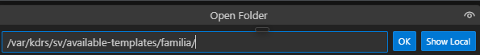

2. Open the `Source Control` view in the activity bar:
  
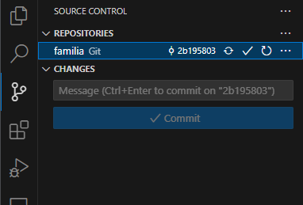

3. In the source control view you can view the status for the current repository. It will show the changes you have made to any files, and allow you to "commit" them. In simplified terms, commiting means saving the changes to the repository. Before making any changes, we need to select which ["branch"](https://www.w3schools.com/git/git_branch.asp) we want to edit. If you look at the image above, you will see the ID "2b195803". This is the currently selected commit, and represents the selected version. If we check the Search & View template manager, we can see that this ID represents the `1.0.0` version:
  
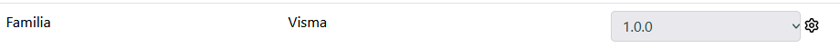
 
Often there can be changes to a template that are not yet part of any released version, so we generally want to make sure to start our editing from the latest point of time in the repository, and not the latest released version. The branch used to hold the most recent code is the `main` branch. To switch to this branch, click the commit ID (which is called the `checkout` button) from the screenshot above and this dialog should show:
  
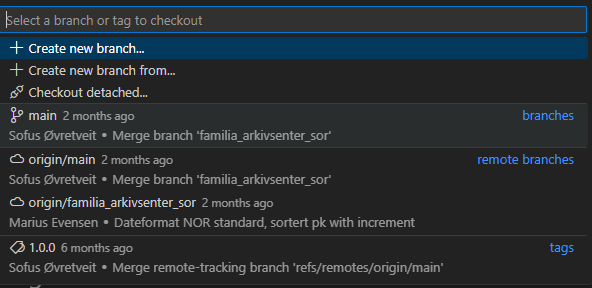
 
Select `main` to switch branch.

4. Click "Synchronize Changes" to make sure you have the latest version from the remote git server.
 
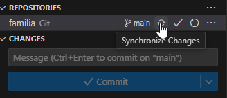

5. Click the "checkout button" again, but now pick "Create new branch"
 
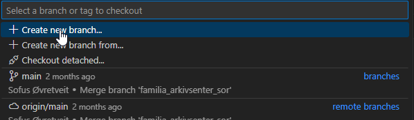
 
Give the branch a name and press `Enter`:
 
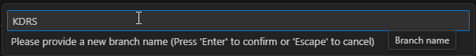
 
If you are making multiple changes, it is a good idea to name the branch after your organization. If you are making a single change, you can give the branch a name representing the change. For example `add-diploma-date` or `fix-date-format`.
 
**Note:** If you already have a branch from before, you can just select that branch instead of making a new one.

6. Now you are on the latest point of time in the repository, on your own branch, so go ahead and make the changes you want.

7. After making your changes you will see a list of all the modified files in the source control view. Click the "Stage all changes" button to prepare all your edits to be commited. You can also stage individual files and make multiple commits for unrelated changes.
 
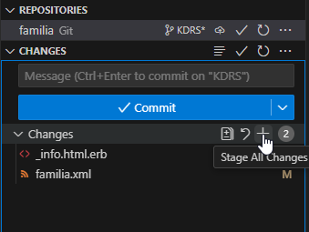

8. Type a message describing the changes you made, and click "Commit"
 
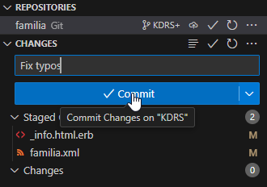

9. Now there is only one step left! Your changes are part of your branch, but your branch is still not sent to the Git server. To upload your branch, make sure you are connected to our VPN, and click "Publish branch".
 
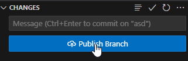
 
If the branch already exists on the Git server, this button will say "Sync changes".

10. To use your changes in your cloud S&V server, log in to your Search & View server and go to `Tools -> Templates`. Click `Update all` in the top left corner.
 
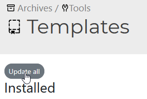

11. Find the template you changed, and click the gear icon to select an unreleased version. A text box will show. Here you can enter `origin/<your-branch>` and press enter.
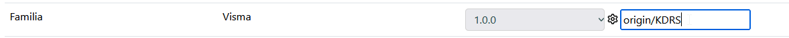
 
Your cloud server is now using your version of the template!