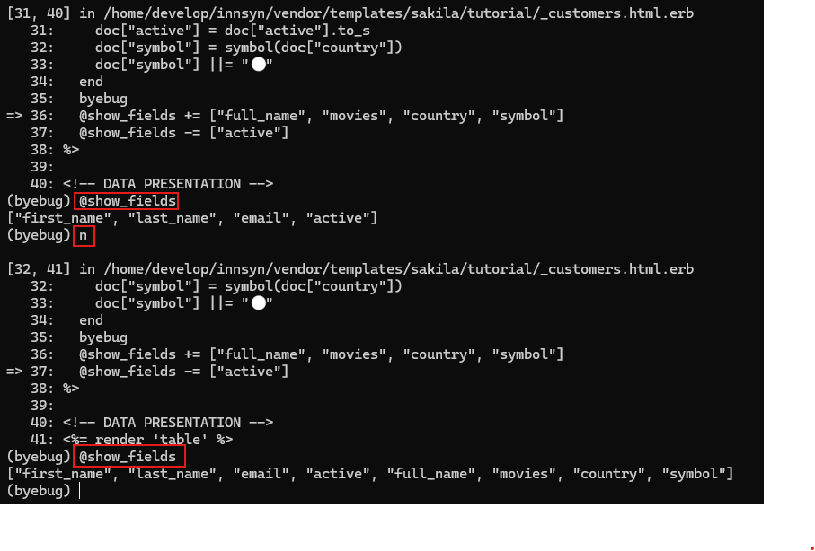
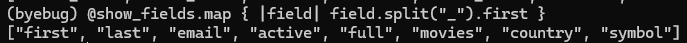

# Debug
Its possible to pause the code to analyze variables, and step through the code.
{: .fs-6 .fw-300 }

## In your Ruby View

require "byebug"


Where a break in the code is needed, enter this

byebug


## Attach to the container
To see the debug window

$ docker attach sv-app


## Using byebug

Once the `byebug` line in your code is hit, the code will stop executing and you will enter the byebug terminal.
In the image below you can see we run 3 commands:

1. `@show_fields` to print the value of this variable
2. `n` or `next` to run the next line of code
3. `@show_fields` again to see that the value has changed

You can also run any Ruby code you want, which can be useful to test that something works the way you expect it to:

Some useful commands in byebug:

- `c` or `continue` - Continue running the code until next time a `byebug` statement is hit
- `n` or `next` - Run the next line of code
- `s` or `step` - Steps inside a method that is on the next line to be ran, unlike `next` which will just run the whole method.
- `help` - To get a list of all byebug commands

## Quit the container
You need to press this key combination to exit the container, if not it will stop.

press ctrl-p, ctrl-q


## If the container stops
If you exit the container by pressing ctrl-c instead of the recommended way, it will stop. In that case:

$ docker start sv-app


