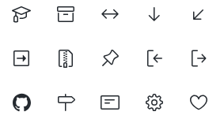

# Styling
How to make your templates look pretty
{: .fs-6 .fw-300 }

## Bootstrap
[Bootstrap](https://getbootstrap.com) makes modern css styling available in templates. 
### Example: Formatting a table

  <table class="table">


### Example: Formatting a small table

  <table class="table table-sm">


See [documentation](https://getbootstrap.com) for other examples

## Octicons
[Octicons](https://primer.style/foundations/icons) make icons available in templates. These are the same icons that Github uses. \

### Example: Make an archive icon

  <%= octicon("archive") %>  


### Example: Make a larger icon

  <%= octicon("archive", height:30) %>  


### Example: Make the icon gray

  <%= octicon("archive", fill:"gray") %>  


`Note` Bootstrap can also show icons, but so far we like the simplicity of Octicons.

## Charts
With [Chartkick](https://chartkick.com) you can use 1 line of Ruby to draw charts.

## Markdown
A) Describe your archive in [Markdown](https://www.markdownguide.org/basic-syntax/) to inform the caseworker.

B) If you need [Markdown](https://www.markdownguide.org/basic-syntax/) in your Ruby View


<%= markdown <<~MARKDOWN
# Heading 1

## Heading 2

### Heading 3
MARKDOWN
%>

